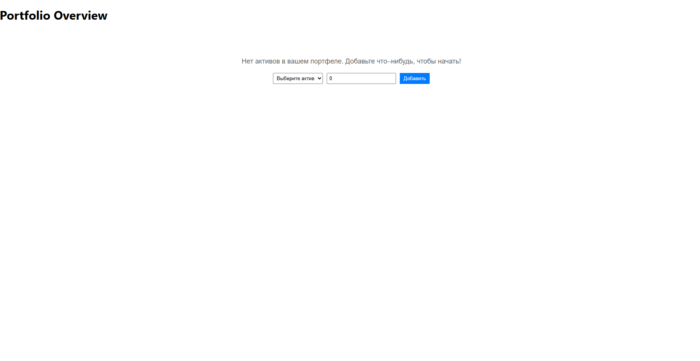
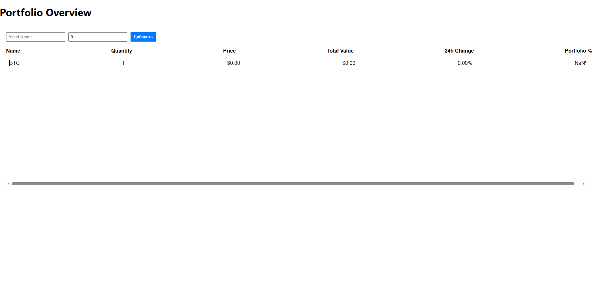

## Основные функции

- **Отображение списка активов**: Название, количество, текущая цена, общая стоимость, изменение за 24 часа и доля в портфеле.
- **Добавление активов**: Пользователь может добавлять новые активы в портфель.
- **Удаление активов**: Активы можно удалять из портфеля.
- **Real-time обновление**: Цены активов обновляются в реальном времени через WebSocket.
- **Локальное сохранение**: Добавленные активы сохраняются в локальном хранилище.

## Технологии

- **React**: Библиотека для создания пользовательского интерфейса.
- **TypeScript**: Добавляет статическую типизацию в JavaScript.
- **Redux Toolkit**: Управление состоянием приложения.
- **WebSocket**: Реальное время обновления данных.
- **SCSS**: Стилизация компонентов.

## Как запустить проект

### 1. Установка зависимостей

Убедитесь, что у вас установлен [Node.js](https://nodejs.org/) и [npm](https://www.npmjs.com/). Затем выполните следующие команды:

#### Клонируйте репозиторий
```bash
git clone https://github.com/Artiishock/PortfolioOverview.git
```
#### Перейдите в директорию проекта
```bash
cd PortfolioOverview

# Установите зависимости
```bash
npm install
```
# запустите проект 
```bash
npm start
```
# Для сборки проекта в production-режиме выполните:
```bash
npm run build
```




